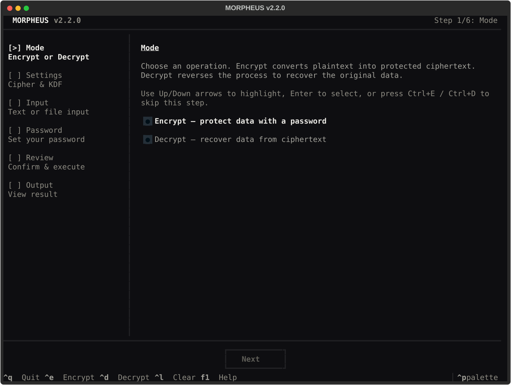
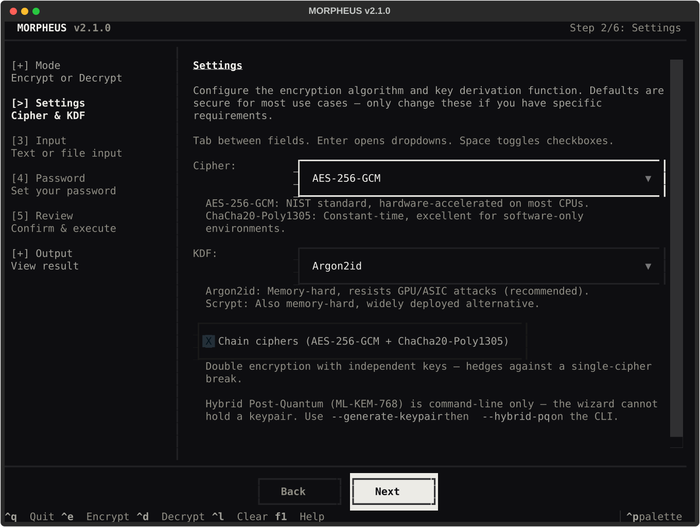
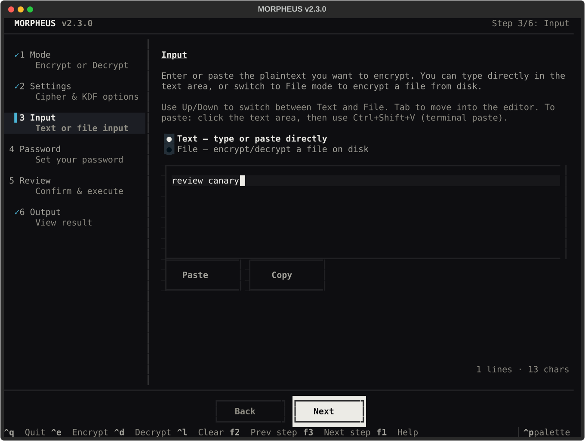
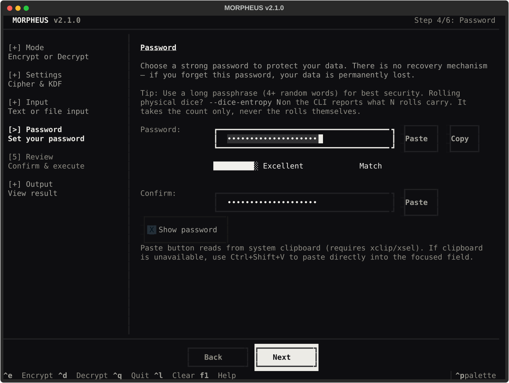
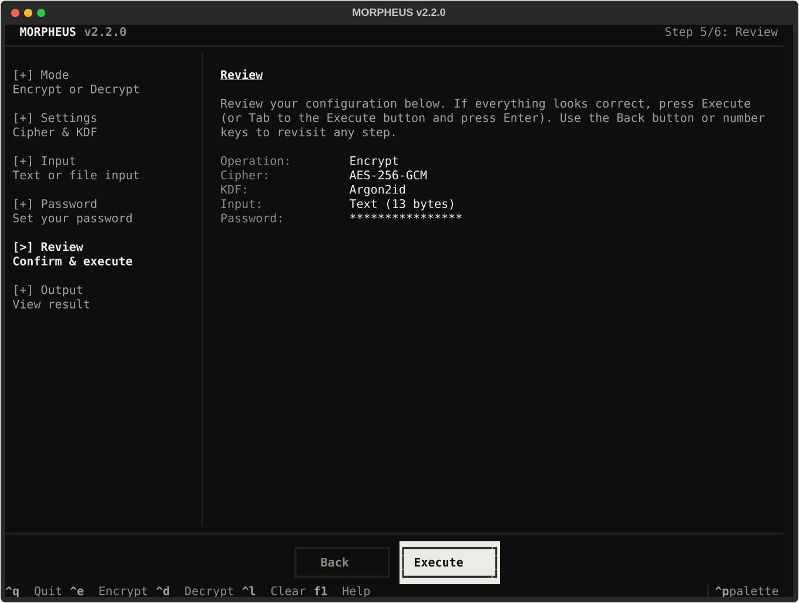
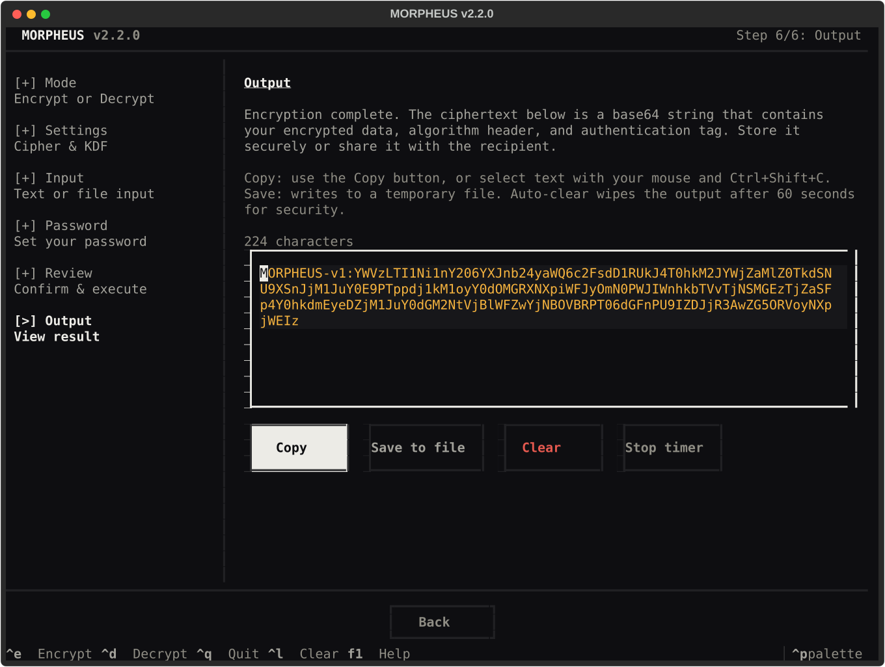

<h1 align="center">MORPHEUS</h1>

<p align="center">
  Quantum-resistant encryption for text and files, in a terminal GUI anyone can operate.<br>
  <strong>AES-256-GCM &middot; ChaCha20-Poly1305 &middot; ML-KEM-768 &middot; Argon2id</strong>
</p>

<p align="center">
  
  
  
  
</p>

<p align="center">
  <a href="#quick-start">Quick Start</a> &middot;
  <a href="#using-the-gui">The Wizard</a> &middot;
  <a href="#rolling-dice-for-a-seed-phrase">Dice for Seed Phrases</a> &middot;
  <a href="docs/USAGE.md">Full Guide</a> &middot;
  <a href="SECURITY.md">Security Policy</a> &middot;
  <a href="CHANGELOG.md">Changelog</a> &middot;
  <a href="CONTRIBUTING.md">Contributing</a>
</p>

<p align="center">
  
</p>

---

## Why MORPHEUS?

Most encryption tools make you choose: easy to use *or* cryptographically
serious. MORPHEUS does both.

**Every encryption it produces is already quantum-resistant** — with no optional
package, no key ceremony, and nothing to configure. That is a property of the
defaults, not of an add-on: Argon2id has no known quantum shortcut, and AES-256
and ChaCha20 keep roughly 128-bit security against Grover's algorithm. The
whole point is that you do not have to do anything to get it.

It wraps that in a terminal GUI anyone can operate — no cryptography degree
required.

**What sets it apart:**

1. **Quantum-resistant by default** — not a mode you have to find and enable
2. **Cipher chaining** — AES-256-GCM *then* ChaCha20-Poly1305 with independent keys
3. **Self-describing authenticated format** — the header, including the KDF
   parameters, is covered by the AEAD tag, so cipher, KDF and parameters cannot
   be tampered with or downgraded
4. **Optional ML-KEM-768** (FIPS 203) for a second, asymmetric factor: encrypt
   to someone's public key so that guessing the password is not enough

> **On the wording.** "Post-quantum" is often used to mean "uses a lattice
> KEM". It is used here in the sense that matters to you: the ciphertext
> resists an attacker with a quantum computer. Symmetric encryption with a
> 256-bit key already does. ML-KEM adds a different property, described
> [below](#why-quantum-resistance-does-not-depend-on-ml-kem).

## At a Glance

| | MORPHEUS | age | gpg | openssl enc |
|---|---|---|---|---|
| Quantum-resistant **password** mode | Yes | Yes | Yes | Yes |
| Quantum-resistant **recipient** mode | ML-KEM-768 (FIPS 203), optional | No — X25519 | No — RSA/ECC | n/a |
| Cipher chaining | AES + ChaCha | -- | -- | -- |
| Terminal GUI | Full TUI with strength meter | -- | -- | -- |
| File encryption | Up to 100 MiB (any type) | Yes | Yes | Yes |
| Memory protection | Best-effort `ctypes.memset` zeroing of key buffers | -- | pinentry | -- |
| Self-describing format | Versioned header, fully AAD-authenticated | Yes | Yes | -- |
| Auto-clear output | 60 s countdown in the TUI | -- | -- | -- |
| KDF | Argon2id / Scrypt | scrypt | S2K | PBKDF2 |

## Quick Start

```bash
git clone https://github.com/404SecNotFound/Morpheus.git
cd Morpheus && pip install -r requirements.txt

# Launch the GUI
python morpheus.py

# Or encrypt from the command line
python morpheus.py -o encrypt --data "sensitive text"

# Encrypt a file
python morpheus.py -o encrypt -f secret.pdf
```

> **You do not need this for quantum resistance** — every encryption above
> already has it. `pip install pqcrypto` is only for `--hybrid-pq`, the mode that
> encrypts to someone else's public key instead of a shared password. See
> [Why quantum resistance does not depend on ML-KEM](#why-quantum-resistance-does-not-depend-on-ml-kem).

> **Clipboard on Linux:** the TUI copies via `pyperclip` and falls back to
> `xclip`/`xsel`/`wl-copy`. If none are installed, copying is unavailable and the
> TUI offers to write the output to a temporary file instead. See
> [What touches the disk](#what-touches-the-disk).

---

## How It Works

### The 30-Second Version

1. You provide **text or a file** and a **strong password**
2. The password is stretched through **Argon2id** (memory-hard: 64 MiB, t=3, p=4)
   into a 256-bit key
3. Your data is encrypted with **AES-256-GCM** (authenticated encryption)
4. The output is a single **base64 string** you can store anywhere

Every encryption produces different output — even for identical inputs —
because a fresh random salt and nonce are generated each time.

### Encryption Modes

Choose your protection level:

| Mode | What Happens | Best For |
|------|-------------|----------|
| **Single cipher** | AES-256-GCM *or* ChaCha20-Poly1305 | Everyday encryption |
| **Cipher chaining** | AES-256-GCM *then* ChaCha20 with independent keys | Defense against single-algorithm compromise |
| **Hybrid PQ** | Password key + ML-KEM-768 shared secret combined via HKDF | Encrypting **to someone else's public key**, with no shared password |
| **Maximum** | Chaining + Hybrid PQ (all layers) | Highest assurance |

All four are quantum-resistant. Hybrid PQ is not the one that makes that true —
see [below](#why-quantum-resistance-does-not-depend-on-ml-kem).

<details>
<summary><strong>How cipher chaining works under the hood</strong></summary>

Your password derives a master key via Argon2id. That master key is expanded
through HKDF into two independent 256-bit subkeys — one for AES-256-GCM, one
for ChaCha20-Poly1305. Your data is encrypted with AES first, then the AES
ciphertext is encrypted again with ChaCha. An attacker must break *both*
algorithms to recover your data.

</details>

<details>
<summary><strong>How hybrid post-quantum works under the hood</strong></summary>

```
Password ──> Argon2id ──> password_key (32 bytes)
                                |
ML-KEM-768 encapsulate ──> kem_shared_secret (32 bytes)
                                |
              HKDF(password_key || kem_shared_secret) ──> final_key
                                                            |
                                                       AES-256-GCM
```

The encryption key is derived from *both* your password *and* a lattice-based
shared secret. An attacker must break Argon2id (brute-force your password)
**and** ML-KEM-768 (solve the Learning With Errors problem).

Because the two are combined with an AND, the result is at least as strong as
the stronger factor. An attacker who does not hold the ML-KEM secret key cannot
get in by guessing the password, however weak it is — which is precisely what
this mode buys you over a password alone.

What it does *not* buy you is quantum resistance, because you already had that:
see [Why quantum resistance does not depend on this](#why-quantum-resistance-does-not-depend-on-ml-kem).

</details>

### Why quantum resistance does not depend on ML-KEM

This is the part most tools get wrong, so it is worth being exact.

A quantum computer threatens the two families of cryptography very differently:

| | Effect of a large quantum computer | Used by MORPHEUS for |
|---|---|---|
| **Symmetric** (AES-256, ChaCha20) | Grover's algorithm halves the effective key length. 256-bit becomes ~128-bit, which is still far beyond reach | Encrypting your data |
| **Password hashing** (Argon2id) | No known quantum shortcut. Memory-hardness is unaffected | Turning your password into a key |
| **Classical asymmetric** (RSA, X25519) | Shor's algorithm breaks it outright | **Nothing.** MORPHEUS does not use it |

Because MORPHEUS never relies on RSA or elliptic curves to protect your data,
there is nothing in the default path for Shor's algorithm to break. A password
and Argon2id and AES-256 is a post-quantum construction, and it always was.

**So what is ML-KEM-768 for?** It solves a different problem: encrypting *to
someone else* without first sharing a password. Tools that offer this normally
do it with X25519 or RSA — which is exactly the part a quantum computer breaks.
MORPHEUS uses a lattice KEM instead, so the recipient mode is quantum-resistant
too.

Put plainly:

- **Just want your data safe from future quantum computers?** Use MORPHEUS
  normally. You already have it, and you never need `pqcrypto`.
- **Want to send something to a colleague without agreeing a password first?**
  That is what `--hybrid-pq` is for, and it needs the optional package.

The honest summary: post-quantum is the floor here, not the upsell.

---

## Using the GUI

Launch with no arguments:

```bash
python morpheus.py
```

The wizard walks you through six steps using **keyboard-only navigation** — no
mouse required. The left sidebar tracks progress and every step includes
contextual hints.

### Encryption Steps (Walkthrough)

#### Step 1 — Mode
Choose an operation: **Encrypt** converts plaintext into protected ciphertext,
**Decrypt** reverses the process. Use `Up/Down` arrows to select, `Enter` to
confirm, or `Ctrl+E` / `Ctrl+D` to skip directly.


#### Step 2 — Settings
Configure the encryption algorithm and key derivation function. Defaults
(AES-256-GCM + Argon2id) are secure for most use cases.

- **Cipher**: AES-256-GCM (NIST standard, hardware-accelerated) or
  ChaCha20-Poly1305 (constant-time, software-optimized)
- **KDF**: Argon2id (memory-hard, resists GPU/ASIC) or Scrypt (widely deployed)
- **Chain ciphers**: Double encryption with independent keys — hedges against a
  single-cipher break
- **Advanced**: Plaintext padding, fixed 64 KiB output, omit filename from
  envelope

Hybrid post-quantum is **not** offered here. It needs an ML-KEM keypair and the
wizard has no way to hold one, so the step points at the CLI route instead. See
[Using the CLI](#using-the-cli).



Use `Tab` between fields, `Enter` to open dropdowns, `Space` to toggle checkboxes.

#### Step 3 — Input
Provide the data to encrypt or decrypt:

- **Text mode**: Type or paste directly into the editor. For pasting, focus the
  text area and use `Ctrl+Shift+V` (terminal paste)
- **File mode**: Enter the full path to the file (e.g. `/home/user/secret.txt`)

Use `Up/Down` to switch between Text and File tabs.



#### Step 4 — Password
For encryption: choose a strong password (4+ random words recommended). The
strength meter updates as you type. You must confirm the password.

For decryption: enter the exact password used during encryption — case and
special characters must match.

The **Paste** button reads from the system clipboard. On macOS and Windows this
works out of the box; on Linux it needs `xclip`, `xsel` or `wl-copy`.
If clipboard is unavailable, use `Ctrl+Shift+V` to paste directly into the
focused field.



#### Step 5 — Review
Review your configuration summary. If everything looks correct, press
**Execute** (`Tab` to the button, then `Enter`). Warnings appear if your
password is weak. Use `Back` or number keys to revisit any step.



#### Step 6 — Output
The result appears in a read-only text area:

- **Copy**: Copies to system clipboard (falls back to a temporary file if no
  clipboard backend is available)
- **Save to file**: Writes output to a temporary file
- **Auto-clear**: Clears the output display after 60 seconds (stop with the
  **Stop timer** button)

> **Scope of auto-clear.** The countdown belongs to the Output step. It clears the
> displayed text, and it is not a guarantee about data already copied elsewhere.
> MORPHEUS does not clear your system clipboard, and leaving the Output step
> cancels the timer. Use `Ctrl+L` to reset all wizard state.



### Keyboard Shortcuts

| Shortcut | Action |
|----------|--------|
| `1`-`6` | Jump directly to a step (if unlocked) |
| `←` / `→` | Previous / next step |
| `Tab` | Cycle through fields in the current step |
| `Enter` | Select / confirm focused element |
| `Space` | Toggle checkboxes |
| `Esc` | Focus the sidebar (then arrow keys to browse) |
| `Ctrl+E` | Quick Encrypt (sets mode + advances) |
| `Ctrl+D` | Quick Decrypt |
| `Ctrl+L` | Clear all and restart |
| `Ctrl+Q` | Quit |
| `F1` | Show keyboard help overlay |

---

## Using the CLI

```bash
# Interactive mode (prompts for operation, input, and password)
python morpheus.py -o encrypt

# Encrypt text
python morpheus.py -o encrypt --data "sensitive text"

# Encrypt with chaining + Scrypt
python morpheus.py -o encrypt --data "text" --chain --kdf Scrypt

# Encrypt a file (any type: text, binary, images, archives)
python morpheus.py -o encrypt -f document.pdf
# -> morpheus_ab12cd34ef56.enc  (random name: the filename is not leaked on disk)

# Decrypt a file (the real name is restored from inside the ciphertext)
python morpheus.py -o decrypt -f morpheus_ab12cd34ef56.enc
# -> document.pdf

# Pipe from stdin
echo "secret" | python morpheus.py -o encrypt --data -

# Generate ML-KEM-768 keypair for hybrid PQ.
# Public key goes to stdout; secret key to a 0600 file (POSIX; on Windows see SECURITY.md).
python morpheus.py --generate-keypair --output my_pq_secret.key

# Hybrid PQ encrypt
python morpheus.py -o encrypt --data "text" \
  --hybrid-pq --pq-public-key <base64-pk>

# Hybrid PQ decrypt
python morpheus.py -o decrypt --data "BAECAg..." \
  --hybrid-pq --pq-secret-key-file my_pq_secret.key

# Use passphrase mode (no digits/specials required)
python morpheus.py -o encrypt --data "text" --passphrase

# Check password against breach databases before encrypting
python morpheus.py -o encrypt --data "text" --check-leaks

# Save your preferred settings for future sessions
python morpheus.py --save-config --cipher ChaCha20-Poly1305 --chain --pad

# Inspect a ciphertext without decrypting (no password needed)
python morpheus.py --inspect --data "BAECAA..."
python morpheus.py --inspect -f secret.enc
```

Passwords should always be entered interactively, so they cannot leak via
`ps`, shell history, or `/proc`. A deprecated `-p/--password` flag still accepts
one from argv for backward compatibility. It is hidden from `--help`, warns when
used, and will be removed. Do not use it.

<details>
<summary><strong>All CLI flags</strong></summary>

| Flag | Description |
|------|-------------|
| `-o, --operation` | `encrypt` or `decrypt` |
| `-d, --data` | Text to encrypt/decrypt. Use `-` for stdin |
| `-f, --file` | File to encrypt/decrypt |
| `--output` | Explicit output path (overrides defaults) |
| `--cipher` | `AES-256-GCM` (default) or `ChaCha20-Poly1305` |
| `--kdf` | `Argon2id` (default) or `Scrypt` |
| `--chain` | Enable cipher chaining |
| `--pad` | Pad plaintext to hide exact length (bucket mode: 256B/1K/4K/16K/64K) |
| `--fixed-size` | Pad all ciphertexts to 64 KiB (constant-size, max privacy). Implies `--pad` |
| `--force` | Overwrite existing output files |
| `--no-strength-check` | Skip password strength validation |
| `--no-filename` | Omit original filename from encrypted envelope |
| `--hybrid-pq` | Enable hybrid post-quantum |
| `--pq-public-key` | Base64 ML-KEM-768 public key. ~1,580 chars, so prefer the file form below |
| `--pq-public-key-file` | Path to a file holding the base64 public key. Preferred over `--pq-public-key`. `--generate-keypair` writes one as `<secret-key-path>.pub` |
| `--pq-secret-key` | Base64 ML-KEM-768 secret key. Discouraged: argv is readable by other local users |
| `--pq-secret-key-file` | Path to a file holding the base64 secret key. Preferred over `--pq-secret-key` |
| `--generate-keypair` | Generate an ML-KEM-768 keypair: public key to stdout, secret key to a 0600 file (POSIX only; on Windows the mode is not applied — see SECURITY.md) |
| `--passphrase` | Use passphrase-mode strength check (word-based, no digit/special requirement). Requires 4+ words and 20+ chars |
| `--check-leaks` | Check password against Have I Been Pwned breach database (k-anonymity, only 5 chars of SHA-1 sent). Requires network |
| `--save-config` | Save current cipher/KDF/flag preferences to `~/.morpheus/config.toml` for future sessions |
| `--inspect` | Inspect a ciphertext header without decrypting (no password needed). Shows format, cipher, KDF, flags, sizes |
| `--benchmark` | Benchmark cipher and KDF performance, recommend optimal config |
| `--dice-entropy N` | Report how much entropy N fair dice rolls carry, and how many more reach 128 or 256 bits. Takes a **count**, never the rolls. Exit code 0 at or above the 128-bit floor, 1 below it, so a script can gate on it |
| `--dice-sides N` | Faces on the die used with `--dice-entropy` (default 6; use 2 for coin flips) |
| `--version` | Print the version and exit. Quote this when reporting an issue |

Passing any flag runs the CLI. Running `python morpheus.py` with no arguments launches the GUI.

See [Rolling Dice for a Seed Phrase](#rolling-dice-for-a-seed-phrase) for what
`--dice-entropy` is actually for.

</details>

---

## Rolling Dice for a Seed Phrase

If you are generating a wallet seed with physical dice, this tells you when to
stop rolling. That is its whole job.

### The 25 minutes that made this necessary

On 30 July 2026 roughly 594 BTC moved out of about 500 addresses in 25 minutes.
A COLDCARD firmware bug had routed seed generation through a software random
number generator instead of the device's hardware one. Mk3 seeds ended up with
roughly 40 bits of real search space against an intended 128, and Mk4, Q and Mk5
with roughly 72.

Users who had added at least 50 of their own dice rolls **were not considered at
risk**, because the firmware mixed those rolls in with the device's own output.
Physical dice survived a total failure of the vendor's generator.

A die is not software. Nobody can push a bad update to it, it has no supply
chain, and you can watch it with your own eyes. That is the entire argument for
rolling, and for counting the rolls correctly.

### The short version

**Roll one die 100 times. Write down each number in order. Stop.**

Hand those 100 numbers to your hardware wallet and it builds the strongest
24-word seed a phrase of that length can hold. The dice are the raw
unpredictability; the wallet does the conversion. Before you start typing, check
you rolled enough:

```bash
python morpheus.py --dice-entropy 100
```

```
  Verdict:    Strong. Clears 256 bits.
              Nobody can guess this, at any budget.
```

You type the **number 100**, not your rolls. MORPHEUS never sees them.

### If your wallet asks for 99 rolls

Some procedures and devices ask for 99, not 100. Roll 100 anyway. The extra roll
costs seconds and there is no downside to being over.

99 rolls give **255.9 bits**, not the 256 that guidance elsewhere rounds it to.
`--dice-entropy` reports the measured figure and names the 0.1-bit gap rather
than rounding into agreement. The difference has no practical consequence, but
100 lands you cleanly above 256 instead of a hair under it.

| Rolls (d6) | Entropy | |
|---|---|---|
| 49 | 126.7 bits | below the floor |
| **50** | **129.2 bits** | clears 128 |
| 99 | 255.9 bits | just short of 256 |
| **100** | **258.5 bits** | clears 256 |

### Doing it properly

1. Take **one** die. Casino dice are ideal: sharp edges, flat faces and flush
   pips make them fair, where cheap rounded dice are slightly biased.
2. Roll it. Write the number down. Roll again. Write it down.
3. Keep going until you have **100 numbers** on paper, in the order you rolled
   them.
4. Type those numbers into your air-gapped hardware wallet's dice entry, and
   nowhere else. Not every wallet offers this. It usually appears during
   new-wallet setup, under a name like "dice rolls" or "add entropy". If yours
   does not have it, stop here: converting the rolls yourself on a
   general-purpose computer is worse than not using dice at all.
5. **Destroy the paper** once the wallet has shown you the seed phrase and you
   have written that down. Until then those 100 numbers *are* your seed, and
   anyone who reads them can rebuild your wallet. Shred or burn it. Do not
   photograph it, and do not keep it as a backup: the seed phrase is the backup.

**Five rules while you roll:**

- **One die at a time.** Do not throw a handful and read them together. Order is
  half the secret, and a batch read in sorted order throws most of it away.
- **Write every result down, in order.**
- **Never re-roll.** If you get six 6s in a row, write six 6s. Re-rolling a
  result because it "looks wrong" destroys the randomness you just made.
- **Nobody watching. No camera. No phone on the table.**
- **Never type the rolls into a computer.** Not into MORPHEUS, not into a
  dice-to-seed web page, not even an offline one.

### How many rolls you need

**What "bits" means here.** A bit is one coin flip's worth of unpredictability.
Two bits is four possible outcomes, ten bits is 1,024, and each bit you add
doubles the number of guesses an attacker must work through. 128 bits is the
floor below which a well-funded attacker can search. 256 bits is the most a
24-word seed phrase can hold, and nothing on Earth searches it.

| You want | Entropy | Six-sided dice | Coin flips |
|---|---|---|---|
| 12-word seed | 128 bits | 50 rolls | 128 flips |
| **24-word seed** | **256 bits** | **100 rolls** | **256 flips** |

Each roll of a fair six-sided die is worth log₂(6) ≈ 2.585 bits. A coin is worth
exactly 1, which is why coins take two and a half times as long.

**Rolling only 50 and asking for 24 words is the trap that matters.** You get a
valid 24-word phrase carrying 129 bits, not 256. It looks like a 24-word seed
and has the strength of a 12-word one. Hashing does not rescue it: SHA-256 over
50 rolls returns 256 bits of output carrying 129 bits of entropy.

**Rolling more than 100 does not help either.** 300 rolls carries 775.5 bits, but
a 24-word seed holds 256 and the format discards the rest. The tool says so:

```
  Verdict:    Strong. Clears 256 bits.
              Nobody can guess this, at any budget.
              100 rolls was enough; the other 200 added nothing,
              because a 24-word seed holds only 256 bits.
```

### What MORPHEUS will not do

**It does not generate seeds, and it should not.** It generates nothing, derives
nothing and stores nothing.

Seed generation belongs on an air-gapped device with a screen you trust. Solving
a bad-generator problem by typing your seed into a laptop sitting next to a
browser trades a known weakness for a worse one.

### What the number cannot tell you

The figure is an upper bound. It holds only if the rolls were **fair,
independent, ordered and private**, and software counting rolls cannot check any
of those. The tool prints all four every run rather than just a number, because
the number is worthless without them.

---

## Security Design

### What We Protect Against

| Threat | Protection |
|--------|-----------|
| Offline password brute-force | Argon2id, 64 MiB memory-hard per guess (`t=3, p=4`). See the note below on cost |
| Future quantum computers | **The default path already covers this.** Argon2id has no known quantum shortcut, and AES-256 / ChaCha20 retain ~128-bit security against Grover. Optional ML-KEM-768 (FIPS 203) adds a second, asymmetric factor — see below |
| Single-algorithm compromise | Cipher chaining (two independent algorithms, independent keys) |
| Memory forensics | Best-effort `ctypes.memset` zeroing of key buffers after use. See limitations |
| Ciphertext tampering | AEAD authentication tag (16 bytes) |
| Algorithm downgrade | Header authenticated as AAD (v4 also binds salt and KEM ciphertext) |
| Ciphertext opening to two plaintexts | v4 32-byte key commitment (~128-bit committing security) |

> **On brute-force cost.** The defence is memory-hardness, not wall-clock time. Each
> guess costs 64 MiB, which is what constrains large-scale parallel attack on GPUs and
> ASICs. Do not assume a fixed seconds-per-guess figure: on a 2024-class laptop a single
> derivation takes roughly 30 ms, so a strong password remains essential. Raise
> `time_cost` if your threat model needs a higher per-guess cost.

### What We Do Not Protect Against

| Limitation | Why |
|-----------|-----|
| Compromised endpoint (malware, keylogger) | No user-space tool can defend against a hostile OS |
| Python `str` immutability | Password briefly exists as an immutable string before `bytearray` conversion; GC timing is unpredictable |
| Immutable copies inside crypto bindings | `secure_zero` clears our own `bytearray` buffers, but OpenSSL and the argon2 bindings receive immutable `bytes` copies that cannot be zeroed |
| Swap to disk | Key buffers are **not** `mlock`ed. On a machine under memory pressure they may be paged to swap. Use full-disk encryption |
| Clipboard contents | MORPHEUS does **not** clear or restore your system clipboard. Anything you copy stays there until you or another application overwrites it, and history managers (Klipper, macOS Universal Clipboard) may retain copies |

### Why These Defaults?

| Setting | Value | Rationale |
|---------|-------|-----------|
| **Argon2id** | `t=3, m=64 MiB, p=4` | OWASP 2024 minimum. Memory-hard, resists GPU/ASIC. The *id* variant resists both side-channel and brute-force |
| **AES-256-GCM** | 256-bit key, 96-bit nonce | NIST standard, AES-NI accelerated. 256-bit key gives ~128-bit post-quantum margin via Grover |
| **ChaCha20-Poly1305** | 256-bit key, 96-bit nonce | Constant-time in software, preferred without AES-NI. Same quantum margin |
| **ML-KEM-768** | FIPS 203, Category 3 | Balances post-quantum security (~AES-192) with practical key sizes. Category 5 doubles sizes for marginal gain |
| **Scrypt** | `n=2^17, r=8, p=1` | RFC 7914, ~128 MiB. Offered where Argon2 is unavailable |
| **Salt** | 16 bytes | Standard for Argon2id/Scrypt. Prevents rainbow tables |
| **Nonce** | 12 bytes | Standard for AES-GCM and ChaCha20. Random nonces safe for expected use |

### What Touches the Disk

Be precise about this rather than claiming a blanket guarantee.

| Path | Writes to disk? |
|------|-----------------|
| CLI text mode (`--data`) | No. Input comes from argv or stdin, output goes to stdout |
| CLI file mode (`--file`) | Yes, by design. Encrypt writes `morpheus_<random>.enc`, so the original filename is not exposed on disk; decrypt restores the real name from inside the ciphertext. `--output` overrides both |
| TUI text mode | Only if you press **Save to file**, or if **Copy** finds no clipboard backend and falls back to a temporary file |
| `--save-config` | Yes. Writes `~/.morpheus/config.toml` (mode `0600` on POSIX; not applied on Windows — see SECURITY.md) |
| Anything else | No temporary plaintext files are created |

Output files inherit your umask. On a shared machine, set a restrictive umask before
decrypting sensitive files.

---

## Ciphertext Format

The format is **self-describing** — the header tells the decryptor exactly what
algorithms were used. No out-of-band configuration needed.

### Format v4 (default for new encryptions)

Same 18-byte header as v3, with the version byte set to `0x04`. Three
differences, all in what is bound and how widely:

| | v3 | v4 |
|---|---|---|
| Key commitment | 8-byte truncated HMAC (~32-bit committing security) | **32-byte** CTX-shaped hash (~128-bit) |
| Commitment covers | the first key only | **all key material** (both subkeys when chained) |
| AAD covers | the 18-byte header | header **+ salt + length-prefixed KEM ciphertext** |
| Hybrid combiner | `HKDF(salt, pw_key ‖ ss, "hybrid-pq-v1")` | binds the **KEM ciphertext, encapsulation key and AAD** per NIST SP 800-227 §4.6.3 |

**v4 payload:** `[salt][nonce(s)][KEM prefix if hybrid][32B commitment][ciphertext + tag(s)]`

The encapsulation key costs no wire bytes — ML-KEM-768 embeds it in the secret
key, so the decryptor recovers it locally.

One limitation v4 does not remove: tampering with the salt or the KEM ciphertext
is detected but still reports as a wrong password, because changing either
changes the derived key. See [SECURITY.md](SECURITY.md).

### Format v3 (still supported for decryption)

```
Offset  Size  Field
------  ----  ----------------------------------
0       1     Version        (0x03)
1       1     Cipher ID      (0x01=AES-256-GCM, 0x02=ChaCha20, 0x03=Chained)
2       1     KDF ID         (0x01=Scrypt, 0x02=Argon2id)
3       1     Flags          (bit 0=chained, bit 1=hybrid PQ, bit 2=padded)
4-5     2     Reserved       (0x0000, validated on read)
6-9     4     KDF param 1    (Argon2: time_cost, Scrypt: n)
10-13   4     KDF param 2    (Argon2: memory_cost, Scrypt: r)
14-17   4     KDF param 3    (Argon2: parallelism, Scrypt: p)
18+     var   Payload
```

v3 stores KDF parameters in the header, enabling decryption without
matching the original pipeline config. It also includes an 8-byte
key-check value in the payload for clear "wrong password" diagnostics.

**v3 payload:** `[salt][nonce(s)][KEM prefix if hybrid][8B key-check][ciphertext + tag(s)]`

### Format v2 (legacy, still supported for decryption)

```
Offset  Size  Field
------  ----  ----------------------------------
0       1     Version        (0x02)
1       1     Cipher ID
2       1     KDF ID
3       1     Flags          (bit 0=chained, bit 1=hybrid PQ)
4-5     2     Reserved       (0x0000)
6+      var   Payload
```

**v2 payload:** `[salt][nonce(s)][KEM prefix if hybrid][ciphertext + tag(s)]`

All header bytes are authenticated as AAD — modifying any byte causes
decryption to fail, preventing algorithm-downgrade attacks.

---

## Testing

```bash
pip install pytest
python -m pytest tests/ -v
```

**671 tests** across 14 test files:

| File | Scope |
|------|-------|
| `test_ciphers.py` | AES-GCM + ChaCha20 roundtrips, NIST SP 800-38D AES-256-GCM vector, RFC 8439 vector, indistinguishability, wrong key/AAD/tampered data |
| `test_kdf.py` | Argon2id + Scrypt derivation, determinism, bytearray returns, salt generation |
| `test_formats.py` | Serialize/deserialize, flag combinations, version/reserved byte validation, AAD collision resistance |
| `test_pipeline.py` | All mode roundtrips (single/chained/hybrid/both), wrong password (`InvalidTag`), cross-compatibility, payload truncation, KEM length=0 bypass, header tampering |
| `test_memory.py` | `secure_zero`, `SecureBuffer`, `secure_key` context manager |
| `test_validation.py` | Password scoring (0-100), minimum requirements, edge cases |
| `test_config.py` | Preference load/save, allow-list validation, file mode |
| `test_fuzz.py` | Property-based fuzzing of the parser against hostile input (requires `hypothesis`) |
| `test_cli.py` | File encrypt/decrypt roundtrip (text + binary), path traversal prevention |
| `test_gui.py` | Wizard mount, step transitions, shortcuts, encrypt/decrypt roundtrip, clipboard fallbacks |
| `test_wizard_state.py` | State validation per step, step unlocking rules, edge cases |
| `test_entropy.py` | Bits per roll for d2/d6/d20, the 128-bit floor and 256-bit target, rolls-needed arithmetic, verdict wording, CLI exit codes |
| `test_vectors.py` | Pinned v2/v3/v4 ciphertexts still decrypt to their recorded plaintext; tampered vectors rejected |
| `test_theme.py` | Palette contrast against the background, accent and low-contrast token restrictions parsed out of the stylesheet, and the rendered colour set pinned against an exported screenshot |

Tests include **NIST SP 800-38D** and **RFC 8439** reference vectors verified
against the `cryptography` library's validated implementations.

---

## Project Structure

```
Morpheus/
├── morpheus_crypt/
│   ├── __init__.py            # Package version
│   ├── __main__.py            # Entry point (auto-detects GUI vs CLI)
│   ├── gui.py                 # Thin shim → ui/app.py
│   ├── cli.py                 # CLI with file encryption support
│   ├── ui/                    # Wizard GUI (Textual)
│   │   ├── app.py             # MorpheusWizard — 2-pane shell, navigation, workers
│   │   ├── theme.py           # Colour tokens + CSS
│   │   ├── state.py           # WizardState dataclass + per-step validation
│   │   ├── sidebar.py         # Left pane step list (✓/▸/dim)
│   │   ├── clipboard.py       # Clipboard backends + temp-file fallback
│   │   └── steps/
│   │       ├── mode.py        # Step 1 — Encrypt / Decrypt
│   │       ├── settings.py    # Step 2 — Cipher, KDF, options
│   │       ├── input.py       # Step 3 — Text editor / file path
│   │       ├── password.py    # Step 4 — Password + strength + paste
│   │       ├── review.py      # Step 5 — Summary + Run
│   │       └── output.py      # Step 6 — Result + copy + countdown
│   └── core/
│       ├── ciphers.py         # AES-256-GCM, ChaCha20-Poly1305
│       ├── kdf.py             # Argon2id, Scrypt
│       ├── pipeline.py        # Orchestration: chaining, hybrid PQ, key lifecycle
│       ├── formats.py         # Versioned binary format with AAD
│       ├── config.py          # Persistent user preferences (~/.morpheus/config.toml)
│       ├── memory.py          # ctypes.memset zeroing of key buffers
│       ├── validation.py      # Password scoring, passphrase mode, breach detection
│       ├── entropy.py         # Dice-roll entropy arithmetic (--dice-entropy)
│       └── errors.py          # MorpheusError hierarchy
├── tests/                     # 671 tests (NIST/RFC vectors included)
├── docs/USAGE.md              # Full guide for technical and non-technical readers
├── SECURITY.md                # Vulnerability disclosure policy
├── CHANGELOG.md               # Version history
├── CONTRIBUTING.md            # Contributor guide
├── .github/workflows/ci.yml   # CI: Python 3.10-3.13 test matrix
├── pyproject.toml
├── requirements.txt
└── LICENSE                    # MIT
```

## Requirements

| Package | Purpose | Required |
|---------|---------|----------|
| `cryptography` | AES-GCM, ChaCha20, Scrypt, HKDF | Yes |
| `argon2-cffi` | Argon2id key derivation | Yes |
| `textual` | Terminal GUI framework | Yes |
| `pyperclip` | Clipboard access (Linux: requires `xclip` or `xsel`) | Yes |
| `pqcrypto` | ML-KEM-768 post-quantum KEM (community wrapper around PQClean, not FIPS-validated, no public audit) | Optional |

Python 3.10+

> **Terminal size**: the GUI needs at least **100x30**. Below that it shows a
> "terminal too small" screen rather than a clipped wizard, and resizing back up
> restores your place and any finished result. The CLI has no size requirement.

> **Linux clipboard**: Install `xclip` or `xsel` for clipboard support: `sudo apt install xclip`

---

## Contributing

See [CONTRIBUTING.md](CONTRIBUTING.md) for guidelines. We welcome:
- Bug reports and security disclosures (see [SECURITY.md](SECURITY.md))
- New cipher or KDF implementations
- Documentation improvements
- Test coverage expansion

## Disclaimer

MORPHEUS is provided **as-is** for educational and personal use. It has not
undergone formal FIPS 140-3 validation or independent third-party audit.
**Do not rely on it as your sole protection** for data subject to legal,
regulatory, or compliance requirements (HIPAA, GDPR, PCI-DSS, etc.).

The authors are not responsible for data loss, unauthorized disclosure, or
any damages resulting from the use of this software. **There is no password
recovery mechanism** — if you forget your password, your data is permanently
and irrecoverably lost.

Use of cryptographic software may be restricted or regulated in some
jurisdictions. You are responsible for compliance with all applicable laws.

## Privacy Notes

- **No telemetry or analytics**: MORPHEUS does not phone home or collect usage
  data. The only network connection is opt-in breach checking (`--check-leaks`),
  which uses k-anonymity and never sends your actual password.
- **Disk usage is narrow but not zero**: CLI text mode is entirely in-memory.
  File mode writes only the ciphertext (or the decrypted original). The TUI
  writes a temporary file if you press **Save to file**, or if **Copy** finds no
  clipboard backend. `--save-config` writes `~/.morpheus/config.toml`. See
  [What Touches the Disk](#what-touches-the-disk).
- **Clipboard is not managed**: MORPHEUS does not clear or restore your system
  clipboard. Anything you copy stays there until something else overwrites it.
- **Plaintext length**: Without `--pad`, ciphertext length reveals approximate
  plaintext length. Use `--pad` for length-hiding (pads to buckets: 256B, 1K,
  4K, 16K, 64K). Bucket membership is still visible.
- **Ciphertext is identifiable**: The versioned header (0x02/0x03/0x04) makes
  MORPHEUS ciphertexts recognizable. This tool does not provide plausible
  deniability or steganography — it is designed for **confidentiality**, not
  **undetectability**.
- **Password as signal**: A strong password (high entropy) may itself signal
  security awareness to an observer. This is inherent to password-based
  encryption.

## License

[MIT](LICENSE)

## Contact

404securitynotfound@protonmail.ch
